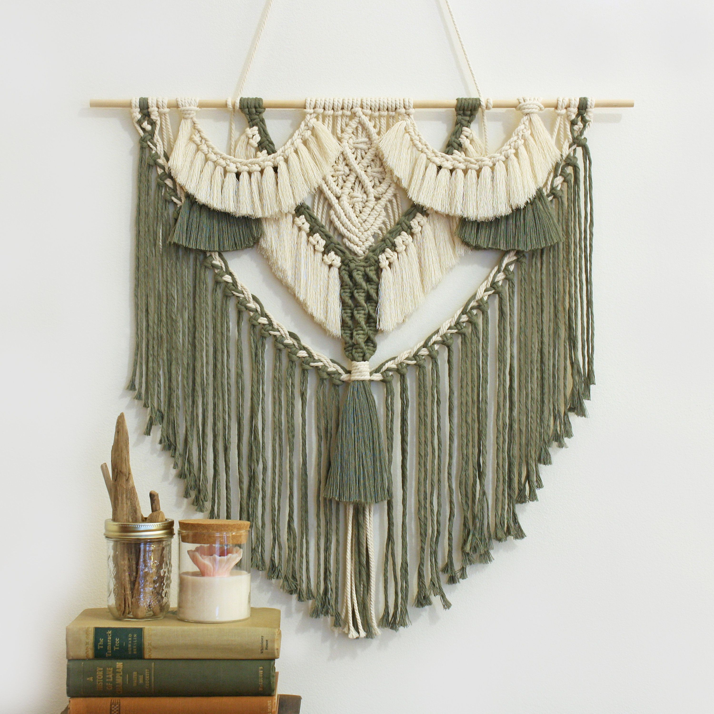
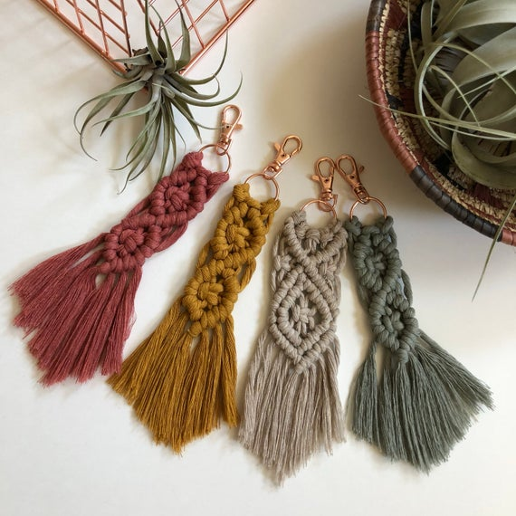
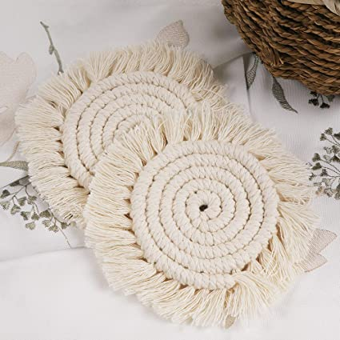

# Easy-Macrame
<!doctype html>
<html>
<head>
<meta charset="UTF-8">
<title>HTML 1</title>
	
	
</head>

<body>
	<h1 title="Try it" style="background-color: antiquewhite; color: saddlebrown" ><strong>Easily Macrame</strong></h1>
	<h2 style="color: peru"><b>An ancient weaving technique</b></h2>
	
Knitting without needles is possible thanks to macrame! Macrame is one of the easy crafts that everyone can do because it is based on weaving and braiding threads with your hands making knots.

	
	 <table> 
	  <tr align="left">
	<th></th>
    <th></th>
    <th></th>
	  </tr>
     </table>
	
	<table style="width:80%; border: thin solid; color: firebrick">
		
  <tr align="left">
    <th style="color: darkolivegreen"><i>Things You Can Do</i></th>
    <th></th>
	<th></th>
   
  </tr>
		
  <tr>
    <td><ins>Wall Hanging</ins></td>
    <td><ins>Key Chains</ins></td>
	<td><ins>Earings</ins></td>
  </tr>
  <tr>
    <td><ins>Coasters</ins></td>
    <td><ins>Dream catchers</ins></td>
	<td><ins>Curtains</ins></td>
  </tr>
  <tr>
	<td><ins>Bags</ins></td>
    <td><ins>Feathers</ins></td>
	<td><ins>Garlands</ins></td>
  </tr>
  <tr>
	<td><ins>Plant Hanger</ins></td>
    <td><ins>Bracelets</ins></td>
	<td><ins>Ornaments</ins></td>
  </tr>
  
</table>

 
	
<h2 id="listNames"><b>Materials</b></h2>
			<li style="color: darkolivegreen">Thick thread, it can be made of cotton, jute, linen, silk or other natural fibers. Your choice will depend on what you want to do.
			<li style="color: darkolivegreen">A base to hold the craft, which can be a pencil or wooden bar.</li>
	        <li style="color: darkolivegreen">Macrame table, in case of certain crafts such as macrame bracelets.</li>
			<li style="color: darkolivegreen">Beads to decorate, such as wooden beads.</li>
	        <li style="color: darkolivegreen">Scissors.</li>
	        <li style="color: darkolivegreen">Brush.</li>
			</li>

<h2 style="color: brown"><b>Macrame knots</b></h2>
	
Macrame are made by making and interlacing knots, which can be the same or of different types. There are more than <i title="50 macrame knots"  style="color:rosybrown; font-size: 20px">50 macrame knots</i> that can be combined to achieve very beautiful results.

	<h3 style="color: firebrick"><em>Head Knot</em></h3>
	  
This knot is what gets your macrame cords attached to an object, such as dowel, branch, or an anchor cord.
<a href="https://www.youtube.com/watch?v=U4OPF0FV5TY">https://www.youtube.com/watch?v=U4OPF0FV5TY</a>
	<h3 style="color: firebrick"><em>Square knot</em></h3> 
	  
A square knot is one of the most widely used macrame knots and need to have at least 4 cords.
<a href="https://youtu.be/9ensp8bMFQA">https://youtu.be/9ensp8bMFQA</a>
	<h3 style="color: firebrick"><em>Spiral knot</em></h3>
	  
Is a series of half knots to create a spiral stitch.
<a href="https://youtu.be/FLeVV9CzMO4">https://youtu.be/FLeVV9CzMO4</a>
	
</body>

</html>
